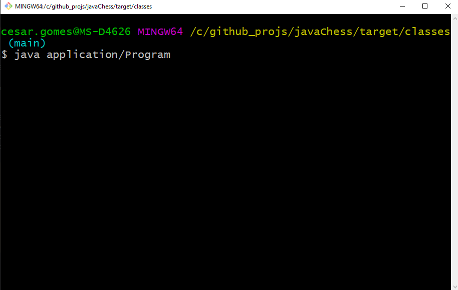
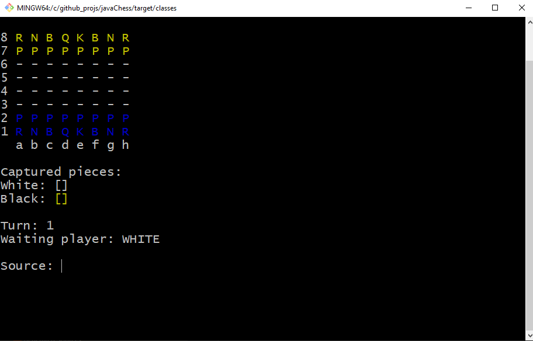

# javaChess

### Projeto de um jogo de xadrez, onde é executado e jogado através de um terminal git bash (ou outro terminal que suporte cores **ANSI** de plano de fundo).
### Para executar, apenas fora feito os testes através dos terminais do Git Bash e do compilador do IntelliJ (outros podem não suportar)
### Formas do qual não suportam o formato de mudança de cores: Powershell e Cmd.

##Rodando através do Git Bash com o código:
`java application/Program`
 
 

 
 
